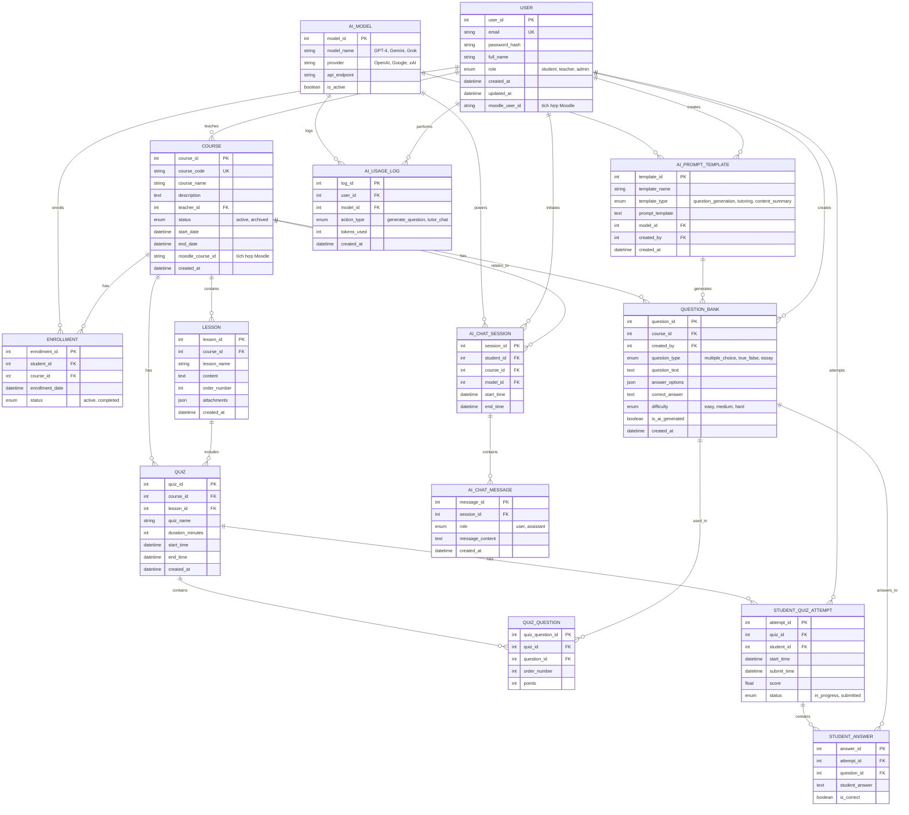

# ERD - Hệ thống Quản lý Học tập (LMS) hỗ trợ AI

## Thông tin đề tài
**Tên đề tài:** Nghiên cứu và phát triển một hệ thống quản lý học tập (Learning Management Systems – LMS) hỗ trợ AI

**Mục tiêu:** Xây dựng hệ thống LMS tích hợp Moodle và các công cụ AI (GPT/Gemini/Grok) để hỗ trợ giảng dạy và sinh câu hỏi tự động.

---

## Sơ đồ ERD (Tối giản)

---

## Mô tả các Entity chính (12 bảng)

### 1. **USER** - Người dùng
Quản lý người dùng trong hệ thống (sinh viên, giáo viên, admin), tích hợp với Moodle.

### 2. **COURSE** - Môn học
Quản lý các môn học, liên kết với giáo viên và tích hợp Moodle.

### 3. **ENROLLMENT** - Đăng ký học
Quản lý việc sinh viên đăng ký vào các môn học.

### 4. **LESSON** - Bài học
Nội dung bài giảng và tài liệu cho từng môn học.

### 5. **AI_MODEL** - Mô hình AI
Quản lý các mô hình AI (GPT-4, Gemini, Grok) được sử dụng trong hệ thống.

### 6. **AI_PROMPT_TEMPLATE** - Mẫu Prompt AI
Lưu trữ các template prompt cho việc sinh câu hỏi và trợ giảng.

### 7. **AI_USAGE_LOG** - Nhật ký sử dụng AI
Theo dõi việc sử dụng AI và chi phí token.

### 8. **QUESTION_BANK** - Ngân hàng câu hỏi
Lưu trữ câu hỏi (tự tạo hoặc AI sinh).

### 9. **QUIZ** - Bài kiểm tra
Quản lý các bài kiểm tra trắc nghiệm.

### 10. **QUIZ_QUESTION** - Câu hỏi trong Quiz
Liên kết câu hỏi với bài kiểm tra.

### 11. **STUDENT_QUIZ_ATTEMPT** - Lần làm bài
Theo dõi các lần sinh viên làm bài kiểm tra.

### 12. **STUDENT_ANSWER** - Câu trả lời
Lưu câu trả lời của sinh viên (chỉ lưu câu trả lời, không có chấm điểm AI).

### 13. **AI_CHAT_SESSION** - Phiên trò chuyện AI
Quản lý các phiên hỏi đáp với AI tutor.

### 14. **AI_CHAT_MESSAGE** - Tin nhắn chat
Lưu trữ nội dung hội thoại giữa sinh viên và AI.

---

## Các tính năng AI chính

### 1. **Sinh câu hỏi tự động**
- Sử dụng `AI_MODEL` và `AI_PROMPT_TEMPLATE`
- Sinh câu hỏi dựa trên nội dung bài học
- Lưu vào `QUESTION_BANK` với flag `is_ai_generated = true`
- Giáo viên có thể review và chỉnh sửa trước khi sử dụng

### 2. **AI Tutor - Trợ giảng ảo**
- Sinh viên chat với AI qua `AI_CHAT_SESSION`
- AI trả lời câu hỏi về môn học
- Lưu lịch sử hội thoại để tham khảo

### 3. **Theo dõi sử dụng AI**
- Log tất cả hoạt động AI vào `AI_USAGE_LOG`
- Theo dõi chi phí token và hiệu quả sử dụng

---

## Tích hợp Moodle

Các trường tích hợp:
- `USER.moodle_user_id`
- `COURSE.moodle_course_id`

Dữ liệu có thể đồng bộ từ Moodle hoặc tích hợp qua API.

---

## Quy trình hoạt động

### Quy trình 1: Tạo câu hỏi bằng AI
1. Giáo viên chọn `AI_PROMPT_TEMPLATE` (loại: question_generation)
2. Nhập nội dung bài học hoặc chủ đề
3. Hệ thống gọi `AI_MODEL` (GPT/Gemini/Grok)
4. AI sinh câu hỏi, lưu vào `QUESTION_BANK`
5. Log lại vào `AI_USAGE_LOG`
6. Giáo viên review và chỉnh sửa

### Quy trình 2: Sinh viên làm bài kiểm tra
1. Sinh viên truy cập `QUIZ`
2. Tạo `STUDENT_QUIZ_ATTEMPT`
3. Trả lời câu hỏi, lưu vào `STUDENT_ANSWER`
4. Hệ thống tính điểm tự động cho câu trắc nghiệm
5. Giáo viên chấm thủ công cho câu tự luận (nếu có)

### Quy trình 3: Chat với AI Tutor
1. Sinh viên tạo `AI_CHAT_SESSION`
2. Gửi câu hỏi → `AI_CHAT_MESSAGE`
3. AI phân tích context (course, lesson)
4. AI trả lời → `AI_CHAT_MESSAGE`
5. Log usage → `AI_USAGE_LOG`
6. Lịch sử chat được lưu trữ

