# ERD - Hệ thống Quản lý Học tập (LMS) hỗ trợ AI

## Thông tin đề tài
**Tên đề tài:** Nghiên cứu và phát triển một hệ thống quản lý học tập (Learning Management Systems – LMS) hỗ trợ AI

**Mục tiêu:** Xây dựng hệ thống LMS tích hợp Moodle và các công cụ AI (GPT/Gemini/Grok) để hỗ trợ giảng dạy, tạo câu hỏi, sinh câu hỏi tự động.

---

## Sơ đồ ERD

```mermaid
erDiagram
    %% Core Entities
    USER {
        int user_id PK
        string email UK
        string password_hash
        string full_name
        string phone
        enum role "student, teacher, admin"
        string avatar_url
        datetime created_at
        datetime updated_at
        boolean is_active
        string moodle_user_id "tích hợp Moodle"
    }

    COURSE {
        int course_id PK
        string course_code UK
        string course_name
        text description
        int teacher_id FK
        enum status "draft, active, archived"
        datetime start_date
        datetime end_date
        string moodle_course_id "tích hợp Moodle"
        datetime created_at
        datetime updated_at
    }

    ENROLLMENT {
        int enrollment_id PK
        int student_id FK
        int course_id FK
        datetime enrollment_date
        enum status "active, completed, dropped"
        float final_grade
        datetime completed_at
    }

    LESSON {
        int lesson_id PK
        int course_id FK
        string lesson_name
        text description
        int order_number
        enum lesson_type "lecture, lab, quiz, assignment"
        text content
        string video_url
        json attachments
        datetime created_at
        datetime updated_at
    }

    %% AI-Related Entities
    AI_MODEL {
        int model_id PK
        string model_name "GPT-4, Gemini, Grok..."
        string provider "OpenAI, Google, xAI"
        string api_endpoint
        json configuration
        boolean is_active
        datetime created_at
        datetime updated_at
    }

    AI_PROMPT_TEMPLATE {
        int template_id PK
        string template_name
        enum template_type "question_generation, answer_evaluation, content_summary, tutoring"
        text prompt_template
        int model_id FK
        json parameters
        int created_by FK "user_id"
        datetime created_at
        datetime updated_at
    }

    AI_USAGE_LOG {
        int log_id PK
        int user_id FK
        int model_id FK
        enum action_type "generate_question, evaluate_answer, tutor_chat"
        text input_text
        text output_text
        int tokens_used
        float cost
        datetime created_at
        int related_entity_id "course_id, question_id..."
        string related_entity_type
    }

    %% Question Bank
    QUESTION_BANK {
        int question_id PK
        int course_id FK
        int created_by FK "user_id"
        enum question_type "multiple_choice, true_false, essay, coding"
        text question_text
        json question_data "câu hỏi chi tiết"
        text correct_answer
        json answer_options
        text explanation
        enum difficulty "easy, medium, hard"
        json tags
        boolean is_ai_generated
        int ai_template_id FK
        datetime created_at
        datetime updated_at
    }

    QUIZ {
        int quiz_id PK
        int course_id FK
        int lesson_id FK
        string quiz_name
        text description
        int duration_minutes
        int total_points
        datetime start_time
        datetime end_time
        boolean shuffle_questions
        boolean show_answers_after
        json settings
        datetime created_at
        datetime updated_at
    }

    QUIZ_QUESTION {
        int quiz_question_id PK
        int quiz_id FK
        int question_id FK
        int order_number
        int points
    }

    STUDENT_QUIZ_ATTEMPT {
        int attempt_id PK
        int quiz_id FK
        int student_id FK
        datetime start_time
        datetime submit_time
        float score
        float max_score
        enum status "in_progress, submitted, graded"
        json answers
        datetime created_at
    }

    STUDENT_ANSWER {
        int answer_id PK
        int attempt_id FK
        int question_id FK
        text student_answer
        float score
        float max_score
        text ai_feedback "phản hồi từ AI"
        int graded_by FK "user_id hoặc AI"
        boolean is_ai_graded
        datetime created_at
    }

    %% AI Tutoring
    AI_CHAT_SESSION {
        int session_id PK
        int student_id FK
        int course_id FK
        int lesson_id FK
        int model_id FK
        datetime start_time
        datetime end_time
        enum status "active, completed"
        json conversation_context
        datetime created_at
    }

    AI_CHAT_MESSAGE {
        int message_id PK
        int session_id FK
        enum role "user, assistant, system"
        text message_content
        json metadata
        datetime created_at
    }

    %% Assignment
    ASSIGNMENT {
        int assignment_id PK
        int course_id FK
        int lesson_id FK
        string assignment_name
        text description
        text requirements
        int max_score
        datetime due_date
        boolean allow_late_submission
        json submission_settings
        datetime created_at
        datetime updated_at
    }

    ASSIGNMENT_SUBMISSION {
        int submission_id PK
        int assignment_id FK
        int student_id FK
        text submission_text
        json attachments
        datetime submitted_at
        float score
        text feedback
        text ai_feedback "phản hồi tự động từ AI"
        int graded_by FK "user_id"
        datetime graded_at
        enum status "submitted, graded, returned"
    }

    %% Analytics & Reports
    LEARNING_ANALYTICS {
        int analytics_id PK
        int student_id FK
        int course_id FK
        date analytics_date
        float engagement_score
        int time_spent_minutes
        int activities_completed
        float average_quiz_score
        json detailed_metrics
        datetime created_at
    }

    AI_RECOMMENDATION {
        int recommendation_id PK
        int student_id FK
        int course_id FK
        enum recommendation_type "study_material, practice_question, review_topic"
        text recommendation_text
        json recommended_resources
        int model_id FK
        boolean is_viewed
        datetime created_at
        datetime viewed_at
    }

    %% Discussion Forum
    DISCUSSION_TOPIC {
        int topic_id PK
        int course_id FK
        int created_by FK "user_id"
        string title
        text content
        boolean is_pinned
        int views_count
        datetime created_at
        datetime updated_at
    }

    DISCUSSION_POST {
        int post_id PK
        int topic_id FK
        int parent_post_id FK "null for root posts"
        int user_id FK
        text content
        text ai_summary "tóm tắt bài post bằng AI"
        int likes_count
        datetime created_at
        datetime updated_at
    }

    %% Notification
    NOTIFICATION {
        int notification_id PK
        int user_id FK
        enum notification_type "assignment_due, quiz_available, grade_posted, ai_recommendation"
        string title
        text content
        json metadata
        boolean is_read
        datetime created_at
        datetime read_at
    }

    %% System Settings
    SYSTEM_SETTINGS {
        int setting_id PK
        string setting_key UK
        string setting_value
        text description
        datetime updated_at
        int updated_by FK "user_id"
    }

    MOODLE_SYNC_LOG {
        int sync_id PK
        enum entity_type "user, course, enrollment, grade"
        int entity_id
        string moodle_entity_id
        enum sync_status "success, failed, pending"
        text error_message
        datetime synced_at
    }

    %% Relationships
    USER ||--o{ COURSE : "teaches"
    USER ||--o{ ENROLLMENT : "enrolls"
    COURSE ||--o{ ENROLLMENT : "has"
    COURSE ||--o{ LESSON : "contains"
    COURSE ||--o{ QUESTION_BANK : "has"
    COURSE ||--o{ QUIZ : "has"
    LESSON ||--o{ QUIZ : "includes"
    QUIZ ||--o{ QUIZ_QUESTION : "contains"
    QUESTION_BANK ||--o{ QUIZ_QUESTION : "used_in"
    QUIZ ||--o{ STUDENT_QUIZ_ATTEMPT : "has"
    STUDENT_QUIZ_ATTEMPT ||--o{ STUDENT_ANSWER : "contains"
    QUESTION_BANK ||--o{ STUDENT_ANSWER : "answers_to"
    
    AI_MODEL ||--o{ AI_PROMPT_TEMPLATE : "uses"
    AI_MODEL ||--o{ AI_USAGE_LOG : "logs"
    AI_MODEL ||--o{ AI_CHAT_SESSION : "powers"
    AI_PROMPT_TEMPLATE ||--o{ QUESTION_BANK : "generates"
    
    USER ||--o{ AI_CHAT_SESSION : "initiates"
    COURSE ||--o{ AI_CHAT_SESSION : "relates_to"
    LESSON ||--o{ AI_CHAT_SESSION : "discusses"
    AI_CHAT_SESSION ||--o{ AI_CHAT_MESSAGE : "contains"
    
    COURSE ||--o{ ASSIGNMENT : "has"
    LESSON ||--o{ ASSIGNMENT : "includes"
    ASSIGNMENT ||--o{ ASSIGNMENT_SUBMISSION : "receives"
    USER ||--o{ ASSIGNMENT_SUBMISSION : "submits"
    
    USER ||--o{ LEARNING_ANALYTICS : "generates"
    COURSE ||--o{ LEARNING_ANALYTICS : "tracks"
    
    USER ||--o{ AI_RECOMMENDATION : "receives"
    COURSE ||--o{ AI_RECOMMENDATION : "relates_to"
    AI_MODEL ||--o{ AI_RECOMMENDATION : "generates"
    
    COURSE ||--o{ DISCUSSION_TOPIC : "has"
    USER ||--o{ DISCUSSION_TOPIC : "creates"
    DISCUSSION_TOPIC ||--o{ DISCUSSION_POST : "contains"
    DISCUSSION_POST ||--o{ DISCUSSION_POST : "replies_to"
    USER ||--o{ DISCUSSION_POST : "writes"
    
    USER ||--o{ NOTIFICATION : "receives"
    USER ||--o{ QUESTION_BANK : "creates"
    USER ||--o{ AI_PROMPT_TEMPLATE : "creates"
    USER ||--o{ AI_USAGE_LOG : "performs"
    USER ||--o{ STUDENT_ANSWER : "grades"
```



---

## Mô tả các Entity chính

### 1. **USER** - Người dùng
Quản lý tất cả người dùng trong hệ thống (sinh viên, giáo viên, admin), tích hợp với Moodle.

### 2. **COURSE** - Môn học
Quản lý các môn học, liên kết với giáo viên và tích hợp Moodle.

### 3. **ENROLLMENT** - Đăng ký học
Quản lý việc sinh viên đăng ký vào các môn học.

### 4. **LESSON** - Bài học
Nội dung bài giảng, video, tài liệu cho từng môn học.

### 5. **AI_MODEL** - Mô hình AI
Quản lý các mô hình AI (GPT-4, Gemini, Grok) được sử dụng trong hệ thống.

### 6. **AI_PROMPT_TEMPLATE** - Mẫu Prompt AI
Lưu trữ các template prompt cho các tác vụ khác nhau (tạo câu hỏi, đánh giá, trợ giảng).

### 7. **AI_USAGE_LOG** - Nhật ký sử dụng AI
Theo dõi việc sử dụng AI, chi phí và hiệu quả.

### 8. **QUESTION_BANK** - Ngân hàng câu hỏi
Lưu trữ câu hỏi (tự tạo hoặc AI sinh), hỗ trợ nhiều loại câu hỏi.

### 9. **QUIZ** - Bài kiểm tra
Quản lý các bài kiểm tra, cấu hình thời gian và cài đặt.

### 10. **STUDENT_QUIZ_ATTEMPT** - Lần làm bài
Theo dõi các lần sinh viên làm bài kiểm tra.

### 11. **STUDENT_ANSWER** - Câu trả lời
Lưu câu trả lời của sinh viên, hỗ trợ chấm điểm tự động bằng AI.

### 12. **AI_CHAT_SESSION** - Phiên trò chuyện AI
Quản lý các phiên hỏi đáp với AI tutor.

### 13. **AI_CHAT_MESSAGE** - Tin nhắn chat
Lưu trữ nội dung hội thoại giữa sinh viên và AI.

### 14. **ASSIGNMENT** - Bài tập
Quản lý bài tập lớn, deadline và yêu cầu.

### 15. **ASSIGNMENT_SUBMISSION** - Bài nộp
Lưu bài nộp của sinh viên, hỗ trợ phản hồi tự động từ AI.

### 16. **LEARNING_ANALYTICS** - Phân tích học tập
Theo dõi tiến độ học tập, engagement của sinh viên.

### 17. **AI_RECOMMENDATION** - Đề xuất từ AI
AI đề xuất tài liệu, bài tập phù hợp với từng sinh viên.

### 18. **DISCUSSION_TOPIC/POST** - Diễn đàn thảo luận
Hỗ trợ thảo luận, AI có thể tóm tắt nội dung.

### 19. **MOODLE_SYNC_LOG** - Nhật ký đồng bộ Moodle
Theo dõi việc đồng bộ dữ liệu với Moodle.

---

## Các tính năng AI chính

### 1. **Sinh câu hỏi tự động**
- Sử dụng `AI_MODEL` và `AI_PROMPT_TEMPLATE`
- Sinh câu hỏi dựa trên nội dung bài học
- Lưu vào `QUESTION_BANK` với flag `is_ai_generated = true`

### 2. **Chấm điểm tự động**
- AI đánh giá câu trả lời tự luận
- Lưu feedback vào `STUDENT_ANSWER.ai_feedback`
- Giáo viên có thể review và điều chỉnh

### 3. **AI Tutor - Trợ giảng ảo**
- Sinh viên chat với AI qua `AI_CHAT_SESSION`
- AI trả lời câu hỏi về môn học
- Lưu lịch sử hội thoại

### 4. **Đề xuất cá nhân hóa**
- AI phân tích `LEARNING_ANALYTICS`
- Tạo `AI_RECOMMENDATION` phù hợp
- Đề xuất tài liệu, bài tập bổ trợ

### 5. **Tóm tắt nội dung**
- AI tóm tắt bài giảng, discussion
- Giúp sinh viên nắm bắt nội dung nhanh

---

## Tích hợp Moodle

Các trường tích hợp:
- `USER.moodle_user_id`
- `COURSE.moodle_course_id`
- `MOODLE_SYNC_LOG` - theo dõi đồng bộ

Dữ liệu có thể đồng bộ 2 chiều hoặc import từ Moodle.

---

## Quy trình hoạt động

### Quy trình 1: Tạo câu hỏi bằng AI
1. Giáo viên chọn `AI_PROMPT_TEMPLATE` (loại: question_generation)
2. Nhập nội dung bài học hoặc chủ đề
3. Hệ thống gọi `AI_MODEL` (GPT/Gemini/Grok)
4. AI sinh câu hỏi, lưu vào `QUESTION_BANK`
5. Log lại vào `AI_USAGE_LOG`
6. Giáo viên review và chỉnh sửa

### Quy trình 2: Sinh viên làm bài kiểm tra
1. Sinh viên truy cập `QUIZ`
2. Tạo `STUDENT_QUIZ_ATTEMPT`
3. Trả lời câu hỏi, lưu vào `STUDENT_ANSWER`
4. AI tự động chấm điểm (nếu được cấu hình)
5. AI tạo feedback chi tiết
6. Giáo viên review kết quả cuối cùng

### Quy trình 3: Chat với AI Tutor
1. Sinh viên tạo `AI_CHAT_SESSION`
2. Gửi câu hỏi → `AI_CHAT_MESSAGE`
3. AI phân tích context (course, lesson)
4. AI trả lời → `AI_CHAT_MESSAGE`
5. Log usage → `AI_USAGE_LOG`
6. Lịch sử chat được lưu trữ

### Quy trình 4: Đề xuất học tập
1. Hệ thống thu thập `LEARNING_ANALYTICS`
2. AI phân tích điểm yếu, điểm mạnh
3. Tạo `AI_RECOMMENDATION`
4. Gửi `NOTIFICATION` cho sinh viên
5. Sinh viên xem và thực hiện đề xuất

---

## Indexes và Optimization

### Indexes quan trọng:
```sql
-- User
CREATE INDEX idx_user_email ON USER(email);
CREATE INDEX idx_user_role ON USER(role);

-- Course
CREATE INDEX idx_course_teacher ON COURSE(teacher_id);
CREATE INDEX idx_course_status ON COURSE(status);

-- Enrollment
CREATE INDEX idx_enrollment_student ON ENROLLMENT(student_id);
CREATE INDEX idx_enrollment_course ON ENROLLMENT(course_id);

-- Question Bank
CREATE INDEX idx_question_course ON QUESTION_BANK(course_id);
CREATE INDEX idx_question_ai_generated ON QUESTION_BANK(is_ai_generated);

-- AI Usage Log
CREATE INDEX idx_ai_log_user ON AI_USAGE_LOG(user_id);
CREATE INDEX idx_ai_log_model ON AI_USAGE_LOG(model_id);
CREATE INDEX idx_ai_log_created ON AI_USAGE_LOG(created_at);

-- Student Answer
CREATE INDEX idx_answer_attempt ON STUDENT_ANSWER(attempt_id);
CREATE INDEX idx_answer_ai_graded ON STUDENT_ANSWER(is_ai_graded);

-- AI Chat
CREATE INDEX idx_chat_session_student ON AI_CHAT_SESSION(student_id);
CREATE INDEX idx_chat_message_session ON AI_CHAT_MESSAGE(session_id);

-- Analytics
CREATE INDEX idx_analytics_student_date ON LEARNING_ANALYTICS(student_id, analytics_date);

-- Notification
CREATE INDEX idx_notification_user_read ON NOTIFICATION(user_id, is_read);
```

---

## Bảo mật và Quyền truy cập

### Roles và Permissions:
- **Student**: Xem bài học, làm bài tập, chat với AI, xem kết quả
- **Teacher**: Tạo khóa học, tạo câu hỏi, chấm bài, xem analytics, sử dụng AI
- **Admin**: Quản lý hệ thống, cấu hình AI, xem toàn bộ dữ liệu

### Bảo mật dữ liệu:
- Mã hóa password (bcrypt/argon2)
- API key của AI models được mã hóa
- Audit log cho các thao tác quan trọng
- Rate limiting cho API calls

---

## Công nghệ đề xuất

### Backend:
- **Database**: PostgreSQL (complex queries, JSON support)
- **ORM**: Prisma/TypeORM
- **API**: Node.js + Express hoặc NestJS
- **Cache**: Redis

### AI Integration:
- **OpenAI SDK** (GPT-4)
- **Google Generative AI SDK** (Gemini)
- **xAI SDK** (Grok)
- **LangChain** - orchestration

### Moodle Integration:
- Moodle Web Services API
- Moodle External API

### Frontend:
- Next.js + React
- TailwindCSS
- Shadcn/ui

---

## Mở rộng tương lai

1. **Multi-language support**: Hỗ trợ nhiều ngôn ngữ
2. **Video AI Analysis**: Phân tích video bài giảng
3. **Plagiarism Detection**: Phát hiện đạo văn bằng AI
4. **Voice AI Tutor**: Trợ giảng bằng giọng nói
5. **Adaptive Learning**: Điều chỉnh nội dung theo năng lực học sinh
6. **Peer Review System**: Hệ thống đánh giá lẫn nhau
7. **Gamification**: Hệ thống điểm, badge, leaderboard

---

## Tổng kết

ERD này thiết kế cho hệ thống LMS hỗ trợ AI với các tính năng:
- ✅ Tích hợp Moodle
- ✅ Nhiều mô hình AI (GPT, Gemini, Grok)
- ✅ Sinh câu hỏi tự động
- ✅ Chấm điểm tự động
- ✅ AI Tutor
- ✅ Đề xuất cá nhân hóa
- ✅ Analytics và báo cáo
- ✅ Discussion forum
- ✅ Assignment management

Hệ thống có thể mở rộng và bảo trì dễ dàng, phù hợp cho đề tài nghiên cứu của sinh viên.

