# ERD - Hệ thống Quản lý Học tập (LMS) hỗ trợ AI

```mermaid
erDiagram
    %% Core Entities
    USER {
        int user_id PK
        string email UK
        string password_hash
        string full_name
        enum role "student, teacher, admin"
        datetime created_at
        datetime updated_at
        string moodle_user_id "tích hợp Moodle"
    }

    COURSE {
        int course_id PK
        string course_code UK
        string course_name
        text description
        int teacher_id FK
        enum status "active, archived"
        datetime start_date
        datetime end_date
        string moodle_course_id "tích hợp Moodle"
        datetime created_at
    }

    ENROLLMENT {
        int enrollment_id PK
        int student_id FK
        int course_id FK
        datetime enrollment_date
        enum status "active, completed"
    }

    LESSON {
        int lesson_id PK
        int course_id FK
        string lesson_name
        text content
        int order_number
        json attachments
        datetime created_at
    }

    %% MCP Server Configuration
    MCP_SERVER {
        int server_id PK
        string server_name UK
        string server_type "moodle, ai_model, database, file_system"
        string endpoint_url
        json connection_config
        json capabilities "list of tools/resources"
        boolean is_active
        datetime created_at
    }

    MCP_TOOL {
        int tool_id PK
        int server_id FK
        string tool_name UK
        string tool_description
        enum tool_category "question_generation, tutoring, data_retrieval"
        json input_schema
        json output_schema
        boolean is_active
        datetime created_at
    }

    MCP_RESOURCE {
        int resource_id PK
        int server_id FK
        string resource_name
        string resource_type "course_content, user_data, quiz_results"
        string resource_uri
        json access_permissions
        datetime created_at
    }

    MCP_EXECUTION_LOG {
        int execution_id PK
        int tool_id FK
        int user_id FK
        json input_parameters
        json output_result
        enum status "success, failed, timeout"
        float execution_time_ms
        text error_message
        datetime executed_at
    }

    %% LangChain Components
    LANGCHAIN_CHAIN {
        int chain_id PK
        string chain_name UK
        enum chain_type "question_generator, tutor_agent, rag_chain"
        text chain_description
        json chain_config "LangChain configuration"
        int created_by FK
        boolean is_active
        datetime created_at
    }

    LANGCHAIN_PROMPT {
        int prompt_id PK
        int chain_id FK
        string prompt_name
        text prompt_template
        json input_variables
        int version
        datetime created_at
    }

    VECTOR_STORE {
        int vector_id PK
        string collection_name
        enum content_type "lesson, course, chat_history"
        int entity_id "lesson_id, course_id..."
        text content_text
        json metadata
        vector embedding "vector embedding (1536 dimensions)"
        datetime created_at
    }

    %% AI Core
    AI_MODEL {
        int model_id PK
        string model_name "GPT-4, Gemini, Grok"
        string provider "OpenAI, Google, xAI"
        string api_endpoint
        json model_config
        int mcp_server_id FK
        boolean is_active
        datetime created_at
    }

    AI_USAGE_LOG {
        int log_id PK
        int user_id FK
        int model_id FK
        int chain_id FK
        enum action_type "generate_question, tutor_chat, rag_query"
        int tokens_used
        float cost
        datetime created_at
    }

    %% Question & Quiz
    QUESTION_BANK {
        int question_id PK
        int course_id FK
        int created_by FK
        enum question_type "multiple_choice, true_false, essay"
        text question_text
        json answer_options
        text correct_answer
        enum difficulty "easy, medium, hard"
        boolean is_ai_generated
        int chain_id FK
        json generation_metadata
        datetime created_at
    }

    QUIZ {
        int quiz_id PK
        int course_id FK
        int lesson_id FK
        string quiz_name
        int duration_minutes
        datetime start_time
        datetime end_time
        datetime created_at
    }

    QUIZ_QUESTION {
        int quiz_question_id PK
        int quiz_id FK
        int question_id FK
        int order_number
        int points
    }

    STUDENT_QUIZ_ATTEMPT {
        int attempt_id PK
        int quiz_id FK
        int student_id FK
        datetime start_time
        datetime submit_time
        float score
        enum status "in_progress, submitted"
    }

    STUDENT_ANSWER {
        int answer_id PK
        int attempt_id FK
        int question_id FK
        text student_answer
        boolean is_correct
    }

    %% AI Tutoring
    AI_CHAT_SESSION {
        int session_id PK
        int student_id FK
        int course_id FK
        int chain_id FK
        string conversation_id
        json session_context
        datetime start_time
        datetime end_time
    }

    AI_CHAT_MESSAGE {
        int message_id PK
        int session_id FK
        enum role "user, assistant"
        text message_content
        json langchain_metadata
        datetime created_at
    }

    %% Relationships - Core
    USER ||--o{ COURSE : "teaches"
    USER ||--o{ ENROLLMENT : "enrolls"
    COURSE ||--o{ ENROLLMENT : "has"
    COURSE ||--o{ LESSON : "contains"
    COURSE ||--o{ QUESTION_BANK : "has"
    COURSE ||--o{ QUIZ : "has"
    LESSON ||--o{ QUIZ : "includes"
    
    %% Relationships - Quiz
    QUIZ ||--o{ QUIZ_QUESTION : "contains"
    QUESTION_BANK ||--o{ QUIZ_QUESTION : "used_in"
    QUIZ ||--o{ STUDENT_QUIZ_ATTEMPT : "has"
    STUDENT_QUIZ_ATTEMPT ||--o{ STUDENT_ANSWER : "contains"
    QUESTION_BANK ||--o{ STUDENT_ANSWER : "answers_to"
    USER ||--o{ STUDENT_QUIZ_ATTEMPT : "attempts"
    
    %% Relationships - MCP
    MCP_SERVER ||--o{ MCP_TOOL : "provides"
    MCP_SERVER ||--o{ MCP_RESOURCE : "exposes"
    MCP_SERVER ||--o{ AI_MODEL : "connects"
    MCP_TOOL ||--o{ MCP_EXECUTION_LOG : "executes"
    USER ||--o{ MCP_EXECUTION_LOG : "triggers"
    
    %% Relationships - LangChain
    LANGCHAIN_CHAIN ||--o{ LANGCHAIN_PROMPT : "uses"
    LANGCHAIN_CHAIN ||--o{ QUESTION_BANK : "generates"
    LANGCHAIN_CHAIN ||--o{ AI_CHAT_SESSION : "powers"
    LANGCHAIN_CHAIN ||--o{ AI_USAGE_LOG : "logs"
    USER ||--o{ LANGCHAIN_CHAIN : "creates"
    
    %% Relationships - Vector Store
    LESSON ||--o{ VECTOR_STORE : "embedded_as"
    COURSE ||--o{ VECTOR_STORE : "embedded_as"
    
    %% Relationships - AI
    AI_MODEL ||--o{ AI_USAGE_LOG : "logs"
    USER ||--o{ AI_USAGE_LOG : "performs"
    
    %% Relationships - Chat
    USER ||--o{ AI_CHAT_SESSION : "initiates"
    COURSE ||--o{ AI_CHAT_SESSION : "relates_to"
    AI_CHAT_SESSION ||--o{ AI_CHAT_MESSAGE : "contains"
    
    %% Relationships - Creation
    USER ||--o{ QUESTION_BANK : "creates"
```

---

## Mô tả các Entity

### **1. Core Entities (4 bảng)**

#### **USER** - Người dùng
**Mô tả:** Quản lý tất cả người dùng trong hệ thống bao gồm sinh viên, giáo viên và admin.

**Thuộc tính chính:**
- `user_id`: Primary key
- `email`: Unique, dùng để đăng nhập
- `role`: Phân quyền (student/teacher/admin)
- `moodle_user_id`: ID người dùng trong Moodle để đồng bộ

**Quan hệ:**
- Một USER có thể dạy nhiều COURSE (role = teacher)
- Một USER có thể đăng ký nhiều COURSE (role = student) thông qua ENROLLMENT
- Một USER có thể tạo nhiều QUESTION_BANK
- Một USER có thể tạo nhiều LANGCHAIN_CHAIN
- Một USER có thể có nhiều AI_CHAT_SESSION
- Một USER có thể có nhiều STUDENT_QUIZ_ATTEMPT

---

#### **COURSE** - Môn học
**Mô tả:** Quản lý các môn học/khóa học trong hệ thống.

**Thuộc tính chính:**
- `course_id`: Primary key
- `course_code`: Mã môn học (unique)
- `teacher_id`: Foreign key đến USER (giáo viên)
- `moodle_course_id`: ID khóa học trong Moodle

**Quan hệ:**
- Một COURSE thuộc về một USER (giáo viên)
- Một COURSE có nhiều ENROLLMENT (sinh viên đăng ký)
- Một COURSE có nhiều LESSON
- Một COURSE có nhiều QUIZ
- Một COURSE có nhiều QUESTION_BANK
- Một COURSE có thể có nhiều AI_CHAT_SESSION

---

#### **ENROLLMENT** - Đăng ký học
**Mô tả:** Quản lý việc sinh viên đăng ký vào các môn học.

**Thuộc tính chính:**
- `enrollment_id`: Primary key
- `student_id`: Foreign key đến USER
- `course_id`: Foreign key đến COURSE
- `status`: Trạng thái (active/completed)

**Quan hệ:**
- Một ENROLLMENT liên kết một USER (student) với một COURSE
- Quan hệ nhiều-nhiều giữa USER và COURSE

---

#### **LESSON** - Bài học
**Mô tả:** Lưu trữ nội dung bài giảng, tài liệu của từng môn học.

**Thuộc tính chính:**
- `lesson_id`: Primary key
- `course_id`: Foreign key đến COURSE
- `content`: Nội dung bài học
- `order_number`: Thứ tự bài học
- `attachments`: File đính kèm (JSON)

**Quan hệ:**
- Một LESSON thuộc về một COURSE
- Một LESSON có thể có nhiều QUIZ
- Một LESSON có thể được embed thành nhiều VECTOR_STORE (cho RAG)

---

### **2. MCP Server Entities (4 bảng)**

#### **MCP_SERVER** - MCP Server
**Mô tả:** Quản lý các MCP Server - middleware layer kết nối hệ thống với external services.

**Thuộc tính chính:**
- `server_id`: Primary key
- `server_type`: Loại server (moodle/ai_model/database/file_system)
- `endpoint_url`: URL của MCP server
- `capabilities`: Danh sách tools và resources server cung cấp

**Các loại MCP Server:**
- **Moodle Server**: Đồng bộ dữ liệu với Moodle
- **AI Model Server**: Gọi API của GPT/Gemini/Grok
- **Vector DB Server**: Quản lý vector database
- **File System Server**: Quản lý files và attachments

**Quan hệ:**
- Một MCP_SERVER có nhiều MCP_TOOL
- Một MCP_SERVER có nhiều MCP_RESOURCE
- Một MCP_SERVER có thể kết nối với nhiều AI_MODEL

---

#### **MCP_TOOL** - Công cụ MCP
**Mô tả:** Các công cụ (functions) mà MCP Server cung cấp.

**Thuộc tính chính:**
- `tool_id`: Primary key
- `server_id`: Foreign key đến MCP_SERVER
- `tool_name`: Tên công cụ (unique)
- `tool_category`: Phân loại công cụ
- `input_schema/output_schema`: Định nghĩa input/output

**Ví dụ tools:**
- `generate_questions`: Sinh câu hỏi từ nội dung
- `tutor_chat`: Trò chuyện với AI tutor
- `get_course_content`: Lấy nội dung từ Moodle
- `query_similar`: Tìm kiếm semantic trong vector DB

**Quan hệ:**
- Một MCP_TOOL thuộc về một MCP_SERVER
- Một MCP_TOOL có nhiều MCP_EXECUTION_LOG

---

#### **MCP_RESOURCE** - Tài nguyên MCP
**Mô tả:** Các resource (dữ liệu) mà MCP Server expose.

**Thuộc tính chính:**
- `resource_id`: Primary key
- `server_id`: Foreign key đến MCP_SERVER
- `resource_uri`: URI của resource
- `resource_type`: Loại resource (course_content/user_data/quiz_results)

**Ví dụ resources:**
- `course://moodle/123`: Khóa học từ Moodle
- `model://openai/gpt-4`: AI model
- `file://attachments/abc.pdf`: File đính kèm

**Quan hệ:**
- Một MCP_RESOURCE thuộc về một MCP_SERVER

---

#### **MCP_EXECUTION_LOG** - Log thực thi MCP
**Mô tả:** Theo dõi các lần gọi MCP tools, để debugging và monitoring.

**Thuộc tính chính:**
- `execution_id`: Primary key
- `tool_id`: Foreign key đến MCP_TOOL
- `user_id`: Foreign key đến USER
- `input_parameters/output_result`: Input và output của tool
- `status`: Trạng thái (success/failed/timeout)
- `execution_time_ms`: Thời gian thực thi

**Quan hệ:**
- Một MCP_EXECUTION_LOG thuộc về một MCP_TOOL
- Một MCP_EXECUTION_LOG thuộc về một USER

---

### **3. LangChain Entities (3 bảng)**

#### **LANGCHAIN_CHAIN** - LangChain Chain
**Mô tả:** Định nghĩa các AI workflow chains trong LangChain.

**Thuộc tính chính:**
- `chain_id`: Primary key
- `chain_type`: Loại chain (question_generator/tutor_agent/rag_chain)
- `chain_config`: Cấu hình chain (JSON)

**Các loại chain:**
- **Question Generator Chain**: Sinh câu hỏi từ lesson content
- **Tutor Agent Chain**: AI chatbot trợ giảng
- **RAG Chain**: Retrieval-Augmented Generation cho câu trả lời có context

**Quan hệ:**
- Một LANGCHAIN_CHAIN có nhiều LANGCHAIN_PROMPT
- Một LANGCHAIN_CHAIN có thể sinh nhiều QUESTION_BANK
- Một LANGCHAIN_CHAIN có thể được dùng trong nhiều AI_CHAT_SESSION
- Một LANGCHAIN_CHAIN có nhiều AI_USAGE_LOG

---

#### **LANGCHAIN_PROMPT** - LangChain Prompt
**Mô tả:** Lưu trữ prompt templates cho LangChain chains với version control.

**Thuộc tính chính:**
- `prompt_id`: Primary key
- `chain_id`: Foreign key đến LANGCHAIN_CHAIN
- `prompt_template`: Template prompt
- `version`: Version của prompt

**Quan hệ:**
- Một LANGCHAIN_PROMPT thuộc về một LANGCHAIN_CHAIN

---

#### **VECTOR_STORE** - Vector Database
**Mô tả:** Lưu trữ vector embeddings của nội dung để sử dụng cho RAG (Retrieval-Augmented Generation).

**Thuộc tính chính:**
- `vector_id`: Primary key
- `collection_name`: Tên collection (lessons/courses/chat_history)
- `content_type`: Loại nội dung
- `entity_id`: ID của entity gốc (lesson_id, course_id...)
- `content_text`: Text đã được embed
- `embedding`: Vector embedding (1536 dimensions cho OpenAI)

**Sử dụng:**
- Khi sinh viên hỏi AI tutor, hệ thống:
  1. Embed câu hỏi
  2. Tìm kiếm similar vectors trong VECTOR_STORE
  3. Lấy nội dung liên quan (lesson content)
  4. Dùng làm context cho LLM

**Quan hệ:**
- Một LESSON có thể có nhiều VECTOR_STORE (chia nhỏ content thành chunks)
- Một COURSE có thể có nhiều VECTOR_STORE

---

### **4. AI Core Entities (2 bảng)**

#### **AI_MODEL** - Mô hình AI
**Mô tả:** Quản lý các mô hình AI (LLM) được sử dụng trong hệ thống.

**Thuộc tính chính:**
- `model_id`: Primary key
- `model_name`: Tên model (GPT-4, Gemini Pro, Grok...)
- `provider`: Nhà cung cấp (OpenAI/Google/xAI)
- `mcp_server_id`: Kết nối với MCP Server để gọi API

**Các model hỗ trợ:**
- GPT-4 (OpenAI)
- GPT-3.5-Turbo (OpenAI)
- Gemini Pro (Google)
- Grok (xAI)

**Quan hệ:**
- Một AI_MODEL kết nối với một MCP_SERVER
- Một AI_MODEL có nhiều AI_USAGE_LOG

---

#### **AI_USAGE_LOG** - Nhật ký sử dụng AI
**Mô tả:** Theo dõi việc sử dụng AI, chi phí tokens và performance.

**Thuộc tính chính:**
- `log_id`: Primary key
- `user_id`: Foreign key đến USER
- `model_id`: Foreign key đến AI_MODEL
- `chain_id`: Foreign key đến LANGCHAIN_CHAIN
- `tokens_used`: Số tokens đã dùng
- `cost`: Chi phí (USD)

**Sử dụng:**
- Theo dõi chi phí API calls
- Phân tích usage patterns
- Billing cho users

**Quan hệ:**
- Một AI_USAGE_LOG thuộc về một USER
- Một AI_USAGE_LOG thuộc về một AI_MODEL
- Một AI_USAGE_LOG thuộc về một LANGCHAIN_CHAIN

---

### **5. Question & Quiz Entities (6 bảng)**

#### **QUESTION_BANK** - Ngân hàng câu hỏi
**Mô tả:** Lưu trữ tất cả câu hỏi (do giáo viên tạo hoặc AI sinh).

**Thuộc tính chính:**
- `question_id`: Primary key
- `course_id`: Foreign key đến COURSE
- `created_by`: Foreign key đến USER
- `question_type`: Loại câu hỏi (multiple_choice/true_false/essay)
- `is_ai_generated`: Flag đánh dấu câu hỏi do AI tạo
- `chain_id`: LangChain chain đã tạo câu hỏi (nếu AI generated)
- `generation_metadata`: Metadata về quá trình sinh (prompt, model, params)

**Quan hệ:**
- Một QUESTION_BANK thuộc về một COURSE
- Một QUESTION_BANK được tạo bởi một USER
- Một QUESTION_BANK có thể được sinh bởi một LANGCHAIN_CHAIN
- Một QUESTION_BANK có thể được dùng trong nhiều QUIZ_QUESTION

---

#### **QUIZ** - Bài kiểm tra
**Mô tả:** Quản lý các bài kiểm tra trắc nghiệm.

**Thuộc tính chính:**
- `quiz_id`: Primary key
- `course_id`: Foreign key đến COURSE
- `lesson_id`: Foreign key đến LESSON (optional)
- `duration_minutes`: Thời gian làm bài
- `start_time/end_time`: Thời gian mở/đóng quiz

**Quan hệ:**
- Một QUIZ thuộc về một COURSE
- Một QUIZ có thể thuộc về một LESSON
- Một QUIZ có nhiều QUIZ_QUESTION
- Một QUIZ có nhiều STUDENT_QUIZ_ATTEMPT

---

#### **QUIZ_QUESTION** - Câu hỏi trong Quiz
**Mô tả:** Bảng trung gian liên kết QUIZ và QUESTION_BANK, định nghĩa câu hỏi nào trong quiz nào.

**Thuộc tính chính:**
- `quiz_question_id`: Primary key
- `quiz_id`: Foreign key đến QUIZ
- `question_id`: Foreign key đến QUESTION_BANK
- `order_number`: Thứ tự câu hỏi trong quiz
- `points`: Điểm của câu hỏi này

**Quan hệ:**
- Một QUIZ_QUESTION thuộc về một QUIZ
- Một QUIZ_QUESTION liên kết với một QUESTION_BANK

---

#### **STUDENT_QUIZ_ATTEMPT** - Lần làm bài
**Mô tả:** Theo dõi các lần sinh viên làm bài kiểm tra.

**Thuộc tính chính:**
- `attempt_id`: Primary key
- `quiz_id`: Foreign key đến QUIZ
- `student_id`: Foreign key đến USER
- `start_time/submit_time`: Thời gian bắt đầu và nộp bài
- `score`: Điểm đạt được
- `status`: Trạng thái (in_progress/submitted)

**Quan hệ:**
- Một STUDENT_QUIZ_ATTEMPT thuộc về một QUIZ
- Một STUDENT_QUIZ_ATTEMPT thuộc về một USER (student)
- Một STUDENT_QUIZ_ATTEMPT có nhiều STUDENT_ANSWER

---

#### **STUDENT_ANSWER** - Câu trả lời
**Mô tả:** Lưu câu trả lời của sinh viên cho từng câu hỏi.

**Thuộc tính chính:**
- `answer_id`: Primary key
- `attempt_id`: Foreign key đến STUDENT_QUIZ_ATTEMPT
- `question_id`: Foreign key đến QUESTION_BANK
- `student_answer`: Câu trả lời của sinh viên
- `is_correct`: Đúng/sai (cho câu trắc nghiệm)

**Quan hệ:**
- Một STUDENT_ANSWER thuộc về một STUDENT_QUIZ_ATTEMPT
- Một STUDENT_ANSWER trả lời cho một QUESTION_BANK

---

### **6. AI Tutoring Entities (2 bảng)**

#### **AI_CHAT_SESSION** - Phiên trò chuyện AI
**Mô tả:** Quản lý các phiên chat giữa sinh viên và AI tutor.

**Thuộc tính chính:**
- `session_id`: Primary key
- `student_id`: Foreign key đến USER
- `course_id`: Foreign key đến COURSE
- `chain_id`: Foreign key đến LANGCHAIN_CHAIN (chain được dùng)
- `conversation_id`: ID conversation trong LangChain
- `session_context`: Context cho RAG (JSON)

**Quan hệ:**
- Một AI_CHAT_SESSION thuộc về một USER (student)
- Một AI_CHAT_SESSION thuộc về một COURSE
- Một AI_CHAT_SESSION sử dụng một LANGCHAIN_CHAIN
- Một AI_CHAT_SESSION có nhiều AI_CHAT_MESSAGE

---

#### **AI_CHAT_MESSAGE** - Tin nhắn chat
**Mô tả:** Lưu trữ từng tin nhắn trong conversation.

**Thuộc tính chính:**
- `message_id`: Primary key
- `session_id`: Foreign key đến AI_CHAT_SESSION
- `role`: Vai trò (user/assistant)
- `message_content`: Nội dung tin nhắn
- `langchain_metadata`: Metadata từ LangChain (retrieved docs, tools used...)

**Quan hệ:**
- Một AI_CHAT_MESSAGE thuộc về một AI_CHAT_SESSION

---

## Tổng quan Quan hệ

### **Quan hệ 1-N (One-to-Many)**
1. USER → COURSE (1 giáo viên - nhiều khóa học)
2. COURSE → LESSON (1 khóa học - nhiều bài học)
3. COURSE → QUIZ (1 khóa học - nhiều quiz)
4. QUIZ → QUIZ_QUESTION (1 quiz - nhiều câu hỏi)
5. MCP_SERVER → MCP_TOOL (1 server - nhiều tools)
6. LANGCHAIN_CHAIN → LANGCHAIN_PROMPT (1 chain - nhiều prompts)
7. AI_CHAT_SESSION → AI_CHAT_MESSAGE (1 session - nhiều messages)

### **Quan hệ N-N (Many-to-Many)**
1. USER ↔ COURSE qua ENROLLMENT (nhiều sinh viên - nhiều khóa học)
2. QUIZ ↔ QUESTION_BANK qua QUIZ_QUESTION (nhiều quiz - nhiều câu hỏi)

### **Quan hệ đặc biệt**
1. **VECTOR_STORE**: Lưu embeddings của LESSON và COURSE cho RAG
2. **MCP_SERVER**: Middleware kết nối với external services (Moodle, AI APIs)
3. **LANGCHAIN_CHAIN**: Orchestrate AI workflows

---
