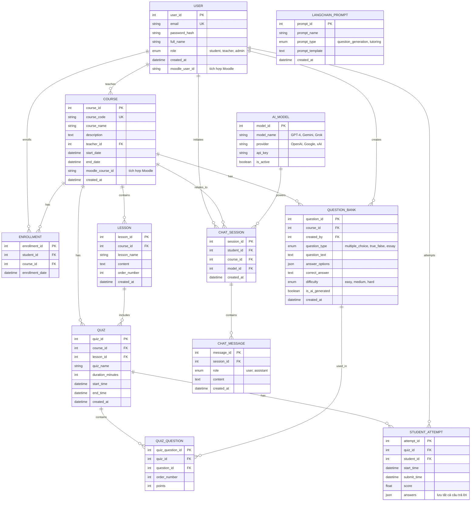

# ERD - Hệ thống Quản lý Học tập (LMS) hỗ trợ AI

---

## Tổng kết

### **Phân loại bảng:**
- **Core (4 bảng):** USER, COURSE, ENROLLMENT, LESSON
- **AI (2 bảng):** AI_MODEL, LANGCHAIN_PROMPT
- **Quiz (4 bảng):** QUESTION_BANK, QUIZ, QUIZ_QUESTION, STUDENT_ATTEMPT
- **Chat (2 bảng):** CHAT_SESSION, CHAT_MESSAGE

### **Tính năng chính:**
1. ✅ Quản lý người dùng và khóa học
2. ✅ Tích hợp Moodle
3. ✅ AI sinh câu hỏi tự động
4. ✅ Quiz và đánh giá
5. ✅ AI Tutor chatbot
6. ✅ Hỗ trợ nhiều AI models
